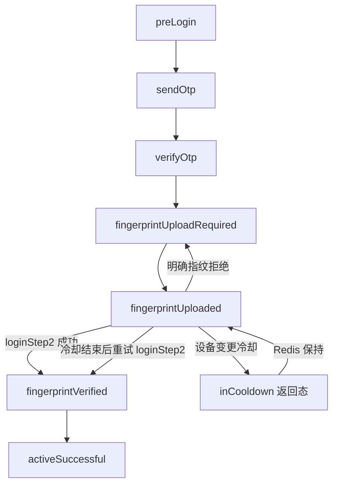

# JCB 冷却期流程设计

## 背景

JazzCashBusiness 指纹验证使用上游 `loginStep2`：

```json
{
  "account_id": "03409297123",
  "should_verify_otpcode": false,
  "should_verify_fingerprint": true,
  "otpcode": "646317"
}
```

当前实现把 `loginStep2` 未返回成功的情况统一降级为 `FP_UPSTREAM_REJECTED`，并把状态退回 `fingerprintUploadRequired`。这会把“设备变更后进入冷却期”误判成“指纹文件无效”，采集端会反复要求用户上传同一份指纹。

## 官方 App 证据

参照 `/Users/tear/apks/com.ibm.jazzcashmerchant@1.2.27_jadx`：

- `resources/res/values/strings.xml` 中存在 `cooldown_hours=120 Minutes`、`cooldown_started_description=Since you have changed the device...`。
- `sources/com/ibm/jazzcash/model/retrofit/Api.java` 中存在接口 `account/merchant/bvs/cooldown`。
- `sources/com/ibm/jazzcash/view/registration/deviceregistartion/PhoneVerificationBVS.java` 会构造 `BvsCoolDownParams`，关键字段包括：
  - `channel=merchant`
  - `verificationType=fingers`
  - `deviceRegistrationFlow=true`
  - `transactionType=bvs-cooldown`
  - `deviceBvsEnabled=true`
  - `deviceCoolEnabled=true`
  - `useCase=deviceChange`
- 同一 APK 另有扫描失败提示 `try_again_in_24_hours`、`fingerprint_error_lockout`，说明“扫描失败/指纹质量问题”和“设备冷却期”是两个不同业务分支。

## 业务判断

JCB 冷却期不是重新上传指纹：

1. 用户已经完成 OTP 提交。
2. 用户已经上传并保存指纹 zip。
3. 上游因设备变更/BVS 流程进入 120 分钟冷却。
4. 本地必须保留 `fingerprintUploaded`，保留 `fingerprint_path`，记录 `cd_until/cooldown_until`。
5. 冷却未结束时，`verify_fingerprint_http` 不再打上游，直接返回等待冷却。
6. 冷却结束后，允许继续用同一份已上传指纹重试 `loginStep2`。
7. 只有明确的扫描失败、指纹质量失败、文件无效，才退回 `fingerprintUploadRequired`。

## 状态机



`inCooldown` 只是接口返回给 App/采集端的展示态，不写入 Redis `status`。Redis/runtime 的唯一真相仍是 `fingerprintUploaded + last_error.code=FP_COOLDOWN + cd_until`。

## 接口返回约定

冷却期返回：

```json
{
  "status": "error",
  "message": "当前处于冷却期，请等待冷却结束后重试",
  "data": {
    "code": "FP_COOLDOWN",
    "phase": "inCooldown",
    "next_phase": "fingerprintUploaded",
    "next_action": "wait_cooldown",
    "cd_until": 1777330000,
    "cooldown_until": 1777330000
  }
}
```

`payment_status_http` 在冷却未结束时也返回 `next_action=wait_cooldown`，避免采集端误以为需要继续上传指纹。

## 不做的事

本次不直接新增调用官方 App 的 `account/merchant/bvs/cooldown`，原因是现有后端接入的是包装后的 JazzCash 上游，当前可观测冷却已经从 `loginStep2`/包装响应返回。贸然新增未接入的官方 App 端接口会引入鉴权、Header、payload 兼容风险。

